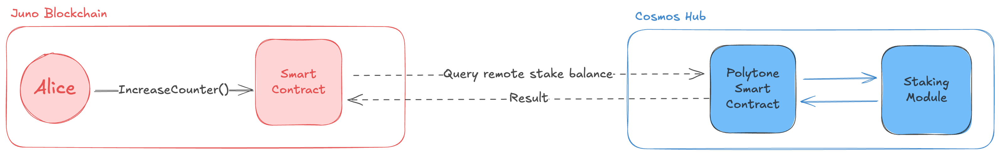

# Easy Interchain Queries with CosmWasm and Polytone

In this tutorial we are going to learn how to create a cross-chain CosmWasm smart contract which has a simple counter that can only be increased if user has a minimum balance of token staked on another chain.



_This is a simplified diagram of the contract we are going to build._

## Environment Setup

To follow this tutorial we need to have many dependacies installed. We are going to use Rust to build the CosmWasm smart contracts and Local Interchain + Docker to spin up local chains, and Hermes to relay IBC packets across the two chains.

For the CosmWasm environment, you can follow this instructions:

- https://book.cosmwasm.com/setting-up-env.html

For Docker, you can follow the official documentation:

- https://docs.docker.com/get-started/get-docker/

For Local Interchain, you can follow the official installation guide:

https://github.com/strangelove-ventures/interchaintest/tree/main/local-interchain

### Check everything is set up

Go

```
dimi@airbox ~ % go version
go version go1.23.2 darwin/arm64
```

Cargo

```
dimi@airbox ~ % cargo --version
cargo 1.83.0 (5ffbef321 2024-10-29)
```

Docker

```
dimi@airbox ~ % docker --version
Docker version 27.3.1, build ce12230
```

Local Interchain

```
dimi@airbox ~ % local-ic version
v8.8.0%
```

Hermes

```
dimi@airbox ~ % hermes --version
hermes 1.10.4
```

## Next step

Continue with chains setup [here](./2-chains.md)
