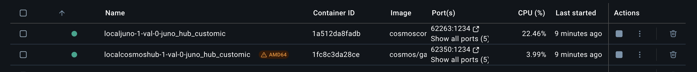

## Chains Setup

Local Interchain is a software built by [Strangelove Ventures](https://strangelove.ventures/) that allows you to spin up local chains and connect them together with IBC.

It works by using Docker under the hood, supporting many public container images of various blockchains.

## Configuration

To use Local Interchain, the first thing we need to do is to create a configuration file, that will describe the topology of the Interchain Network we want to spin up.

Full documentation about the configuration file can be found [here](https://github.com/strangelove-ventures/interchaintest/tree/main/local-interchain#base-chain-template).

The configuration file we are going to use is the following, and includes:

- Local Juno blockchain, with 2 accounts
- Local Cosmos Hub blockchain, with 2 accounts
- Ports customization
- 1.5s block time

```json
{
  "chains": [
    {
      "name": "juno",
      "chain_id": "localjuno-1",
      "denom": "ujunox",
      "binary": "junod",
      "bech32_prefix": "juno",
      "docker_image": {
        "repository": "ghcr.io/cosmoscontracts/juno",
        "version": "v24.0.0"
      },
      "host_port_override": {
        "1317": "1318",
        "9090": "9091",
        "26656": "26056",
        "26657": "26057"
      },
      "gas_prices": "0%DENOM%",
      "chain_type": "cosmos",
      "coin_type": 118,
      "trusting_period": "112h",
      "gas_adjustment": 2,
      "number_vals": 1,
      "number_node": 0,
      "block_time": "1500ms",
      "debugging": true,
      "genesis": {
        "accounts": [
          {
            "name": "acc0",
            "address": "juno1hj5fveer5cjtn4wd6wstzugjfdxzl0xps73ftl",
            "amount": "10000000%DENOM%",
            "mnemonic": "decorate bright ozone fork gallery riot bus exhaust worth way bone indoor calm squirrel merry zero scheme cotton until shop any excess stage laundry"
          },
          {
            "name": "acc1",
            "address": "juno1efd63aw40lxf3n4mhf7dzhjkr453axurv2zdzk",
            "amount": "10000000%DENOM%",
            "mnemonic": "wealth flavor believe regret funny network recall kiss grape useless pepper cram hint member few certain unveil rather brick bargain curious require crowd raise"
          }
        ]
      }
    },
    {
      "name": "gaia",
      "chain_id": "localcosmoshub-1",
      "binary": "gaiad",
      "bech32_prefix": "cosmos",
      "denom": "uatomx",
      "docker_image": {
        "repository": "ghcr.io/cosmos/gaia",
        "version": "v21.0.1"
      },
      "host_port_override": {
        "1317": "1319",
        "9090": "9092",
        "26656": "26156",
        "26657": "26157"
      },
      "genesis": {
        "accounts": [
          {
            "name": "second0",
            "address": "cosmos1hj5fveer5cjtn4wd6wstzugjfdxzl0xpxvjjvr",
            "amount": "10000000%DENOM%",
            "mnemonic": "decorate bright ozone fork gallery riot bus exhaust worth way bone indoor calm squirrel merry zero scheme cotton until shop any excess stage laundry"
          },
          {
            "name": "second1",
            "address": "cosmos1efd63aw40lxf3n4mhf7dzhjkr453axur6cpk92",
            "amount": "10000000%DENOM%",
            "mnemonic": "wealth flavor believe regret funny network recall kiss grape useless pepper cram hint member few certain unveil rather brick bargain curious require crowd raise"
          }
        ]
      },
      "block_time": "1500ms",
      "gas_prices": "0%DENOM%",
      "gas_adjustment": 2
    }
  ]
}
```

You can find the configuration file in this repository, under `./local-ic/chains/juno_hub_custom.json`

## Spin up the chains

By default local-ic requires chain configuration files to be located in the interchain-test repository directory, but we can customize this behavior by setting the env var `ICTEST_HOME`.

In this tutorial we are going to use this repository as our workdir, assuming it's cloned under `~/polytone-workshop`.

```bash
ICTEST_HOME=~/polytone-workshop/local-ic-config local-ic start juno_hub_custom.json
```

Run this in a new terminal, and keep the process running.

## Check containers are running

Now we need to make sure everything is running correctly.

We can use the integrated RPC endpoints provided by the two blockchains to check we have blocks:

```bash
curl -s http://127.0.0.1:26157/status | jq .result.sync_info.latest_block_height
```

This should give the current block height of the Cosmos Hub local blockchain.
If you call the same command again, you should see the block height increment.

```bash
curl -s http://127.0.0.1:26057/status | jq .result.sync_info.latest_block_height
```

This should give the current block height of the Juno local blockchain.
If you call the same command again, you should see the block height increment.

## Check containers using docker desktop

You can also check the status of containers using the docker desktop application.



## Next Steps

Continue with polytone setup [here](./3-polytone.md)
