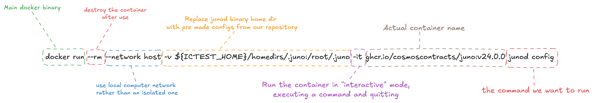

## Polytone Setup

Polytone is a smart contract that allows generic cross-chain communication on any Cosmwasm-enabled blockchain, powered by IBC. It has been developed by DAODAO and is currently deployed in production on many chains.

In production, you don't actually need to deploy polytone yourself but you can use the contracts deployed by their team.

Find a comprensive list of production polytone contracts [here](https://github.com/DA0-DA0/dao-dao-ui/blob/development/packages/utils/constants/polytone.json)

## Configuration

To easily interact with our two blockchains we created two configuration folders inside `./local-ic-config/homedirs`.
We can mount this folder in an interactive docker container to communicate with the running nodes.

### Junod binary in docker container configuration

```bash
export ICTEST_HOME=~/polytone-workshop/local-ic-config
docker run --rm --network host -v ${ICTEST_HOME}/homedirs/.juno:/root/.juno -it ghcr.io/cosmoscontracts/juno:v24.0.0 junod config
```

As you can see, this command will give output the configuration of the junod client.

```json
{
  "chain-id": "localjuno-1",
  "keyring-backend": "test",
  "output": "text",
  "node": "tcp://127.0.0.1:26057",
  "broadcast-mode": "sync",
  "gas": "auto",
  "gas-prices": "0.01ujunox",
  "gas-adjustment": "2",
  "fees": "",
  "fee-granter": "",
  "fee-payer": "",
  "note": ""
}
```

If you are not familiar with docker, here is an explaination of all the flags of the command above:



### Gaiad binary in docker container configuration

Here a similar command for gaiad. Since Cosmos Hub (gaiad) is using a different version of Cosmos-SDK and a different implementation of configuration files, the command is a little bit different.

```bash
export ICTEST_HOME=~/polytone-workshop/local-ic-config
docker run --entrypoint /usr/local/bin/gaiad --rm --network host -v ${ICTEST_HOME}/homedirs/.gaia:/home/nonroot/.gaia -it ghcr.io/cosmos/gaia:v21.0.1 config view client
```

The main differences are:

1. Entrypoint flag: this is used to tell the container the binary we want to run. It's needed because of how the docker image for gaiad is build.
1. Volume flag: it has a different path, since in gaiad docker image is using a "nonroot" user rather than root.
1. Command: we are omitting "gaiad" binary, since it's already specified in the entrypoint flag, and we are using "config view client" rather than only "config" to get the client configuration.

the result of the command should look like this:

```toml
# This is a TOML config file.
# For more information, see https://github.com/toml-lang/toml

###############################################################################
###                           Client Configuration                          ###
###############################################################################

# The network chain ID
chain-id = "localcosmoshub-1"
# The keyring's backend, where the keys are stored (os|file|kwallet|pass|test|memory)
keyring-backend = "test"
# CLI output format (text|json)
output = "text"
# <host>:<port> to CometBFT RPC interface for this chain
node = "tcp://localhost:26157"
# Transaction broadcasting mode (sync|async)
broadcast-mode = "sync"
```

You can see that node and chain id are correctly set.

### Alias setup

To simplify the next commands, we are going to create two bash aliases, so that we can focus on junod and gaiad flags only instead of repeting all the docker configuration flags every time

```bash
alias gaiad-docker="docker run --entrypoint /usr/local/bin/gaiad --rm --network host -v ${ICTEST_HOME}/homedirs/.gaia:/home/nonroot/.gaia -it ghcr.io/cosmos/gaia:v21.0.1"
alias junod-docker="docker run --rm --network host -v ${ICTEST_HOME}/homedirs/.juno:/root/.juno -it ghcr.io/cosmoscontracts/juno:v24.0.0 junod"
```

from now on, you can use `junod-docker` and `gaiad-docker` to run commands against our two local blockcahins.

If you type `junod-docker config` or `gaiad-docker config view client` you should get the same result of the command ran before.

## Deploy Polytone Contracts

Now that we finally have our command line utilities correctly set-up, we can finally deploy the smart contracts.

Polytone is composed by 4 smart contracts:

1. Note: This is used on host chains to "send" requests to the remote chains.
2. Voice: This is used to receive messaged from the host chain and replay back with callbacks.
3. Proxy: Not used in this example, it's used to execute transactions in behalf of an user.
4. Listener: This is an example contract to receive and log callbacks. We are going to use this initially, and then replace with out counter game contract.

### Juno

On Juno we need to store and instantiate only the Note and Listener contracts.

```bash
junod-docker tx wasm store /root/.juno/artifacts/polytone_note-aarch64.wasm --from acc1 -y
junod-docker tx wasm store /root/.juno/artifacts/polytone_listener-aarch64.wasm --from acc1 -y
```

if everything is successfull, by querying store codes we should see 2 code ids:

```bash
dimi@192 polytone-workshop % junod-docker q wasm codes
code_infos:
- code_id: "1"
  creator: juno1hj5fveer5cjtn4wd6wstzugjfdxzl0xps73ftl
  data_hash: D08BE8A070AADFDC0E8BDC91C3CE86054A840999874B2FC44806A1CD17611E98
  instantiate_permission:
    addresses: []
    permission: Everybody
- code_id: "2"
  creator: juno1hj5fveer5cjtn4wd6wstzugjfdxzl0xps73ftl
  data_hash: B7364CB2F115120D39912FCC276E8AA115C00C95C02DEA33C83B25D6C5A141E4
  instantiate_permission:
    addresses: []
    permission: Everybody
pagination:
  next_key: null
  total: "0"
```

Now that smart contract code are stored, we can proceed with their instantiation:

```bash
junod-docker tx wasm instantiate 1 '{"block_max_gas":"2000000"}' --label "polytone_note_to_hub" --no-admin -y --from acc1
junod-docker tx wasm instantiate 2 '{"note": "juno14hj2tavq8fpesdwxxcu44rty3hh90vhujrvcmstl4zr3txmfvw9skjuwg8"}' --label "polytone_listener_from_hub" --no-admin --from acc1 -y
```

Since we are in a "controlled" environment, and contract addresses are deterministic, these two command will instantiate contracts with the following addresses:

- Note: `juno14hj2tavq8fpesdwxxcu44rty3hh90vhujrvcmstl4zr3txmfvw9skjuwg8`
- Listener: `juno1nc5tatafv6eyq7llkr2gv50ff9e22mnf70qgjlv737ktmt4eswrq68ev2p`

In case you have a different setup, you can query contract addresses by code with the following command `junod-docker q wasm list-contract-by-code <CODE_ID>`

### Gaia

On our local Cosmos Hub chain we need to store the voice and proxy, and instantiate only the voice. We can do it with the following commands:

```bash
gaiad-docker tx wasm store /home/nonroot/.gaia/artifacts/polytone_voice-aarch64.wasm --from acc1 --gas auto --gas-adjustment 2 --gas-prices 1uatomx -y
gaiad-docker tx wasm store /home/nonroot/.gaia/artifacts/polytone_proxy-aarch64.wasm --from acc1 --gas auto --gas-adjustment 2 --gas-prices 1uatomx -y
```

In this case, you can see that we need to append gas flags to the commands, that's because gaiad don't support gas settings inside the client configuration, so we need to specify it every single time.

Also in this case, you can verify codes are correctly stored with the following command:

```bash
dimi@192 polytone-workshop % gaiad-docker q wasm list-codes
WARNING: The requested image's platform (linux/amd64) does not match the detected host platform (linux/arm64/v8) and no specific platform was requested
code_infos:
- code_id: "1"
  creator: cosmos1hj5fveer5cjtn4wd6wstzugjfdxzl0xpxvjjvr
  data_hash: 69F016314A346B71510F470DB474642F7C4AF6DBDB10CF25D8DBAF7FF81829B9
  instantiate_permission:
    addresses: []
    permission: Everybody
- code_id: "2"
  creator: cosmos1hj5fveer5cjtn4wd6wstzugjfdxzl0xpxvjjvr
  data_hash: CDA1223DEEA22FDA83599AA4CEA769EFDA71A0F16FD33FD5A9D26A7A9049FE20
  instantiate_permission:
    addresses: []
    permission: Everybody
pagination:
  next_key: null
  total: "0"
```

Now we can proceed instantiating the voice contract, using the proxy code id as parameter:

```bash
gaiad-docker tx wasm instantiate 1 '{"proxy_code_id":"2", "block_max_gas":"2000000"}' --label "polytone_voice_from_juno" --no-admin --gas auto --gas-adjustment 2 --gas-prices 1uatomx -y --from acc1
```

Also in this case, because we are in a controlled environment, the voice contract will be instantiated with this address:

- Voice: `cosmos14hj2tavq8fpesdwxxcu44rty3hh90vhujrvcmstl4zr3txmfvw9s4hmalr`

In case you are using a different environment you can check the address with the following command: `gaiad-docker q wasm list-contract-by-code 1`

## Next step

Continue with relayer setup [here](./4-relayer.md)
